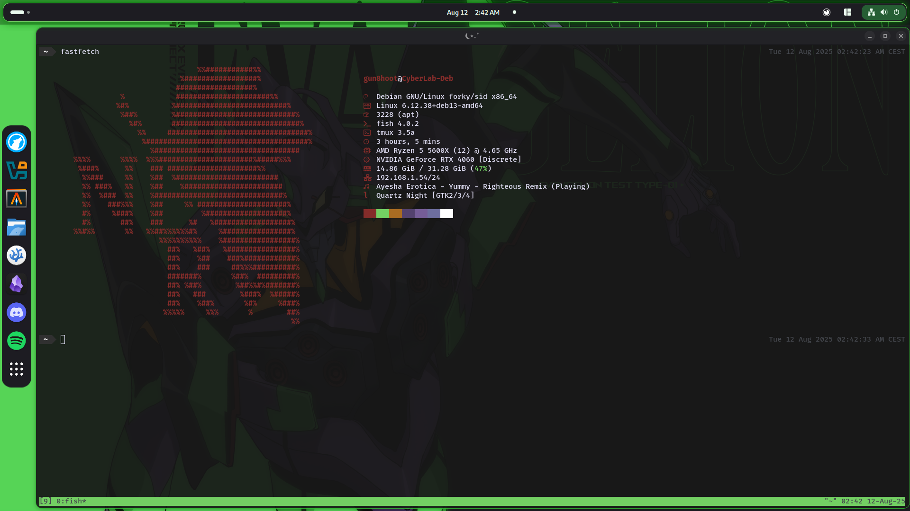
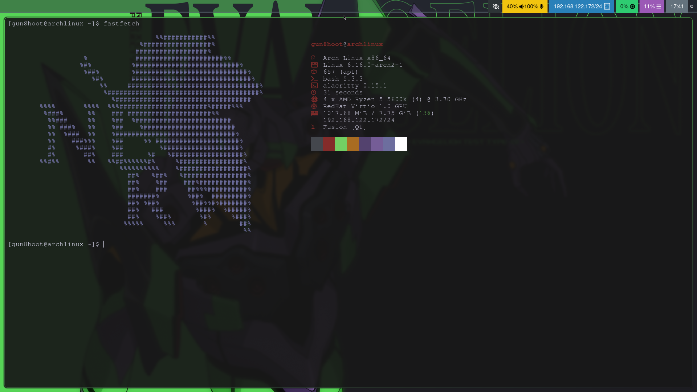
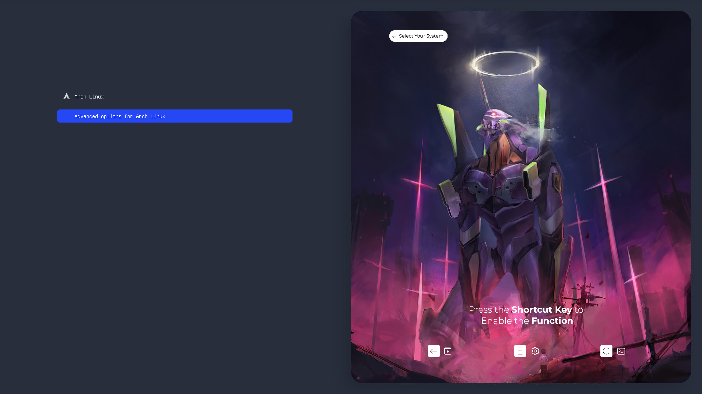

# Gun8.dotfile
My personal dotfile collection

## ROG x EVANGELION
\> Gnome
---
##### TODO : 
- xxx
<br>
##### **Preview :**



<br><br>

### HYPRLAND
---
##### **Preview :**


**NOT FINISH**
<br><br>


### GRUB
---
- Original grub theme : **[Particle GRUB Theme](https://www.gnome-look.org/p/2269763)**
#### STEP : 
1. Copy the content in `/boot/grub/themes`
```sh
sudo cp -R ./grub/EVA=ANGEL /boot/grub/themes
```
2. Edit the `/etc/default/grub`
```sh
GRUB_THEME="/boot/themes/EVA=ANGEL/theme.txt"
GRUB_GFXMODE=1920x1080 # Optional, change the resolution of the boot menu
```
3. Update grub
```sh
sudo grub-mkconfig -o /boot/grub/grub.cfg
```
##### **Preview :** 




<br><br>