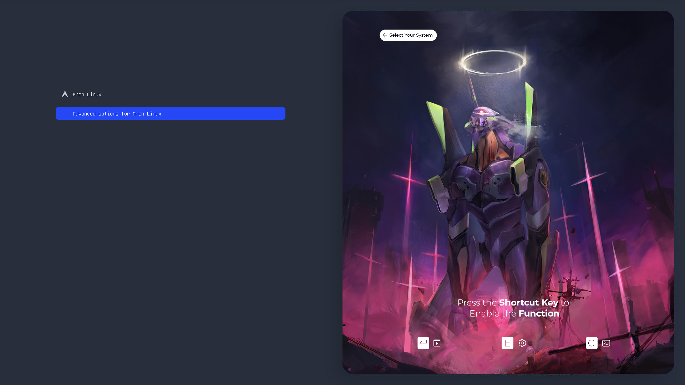

# 👼 • EVA
- 
## 🖥️ • Overall
<a href="#"></a>

<br>

---

#### STEP : 
1. Copy the content in `/boot/grub/themes`
```sh
sudo cp -R ./grub/EVA /boot/grub/themes
```
2. Edit the `/etc/default/grub`
```sh
GRUB_THEME="/boot/themes/EVA/theme.txt"
GRUB_GFXMODE=1920x1080 # Optional, change the resolution of the boot menu
```
3. Update grub
```sh
sudo grub-mkconfig -o /boot/grub/grub.cfg
```

<br><br>

# 💡 • Sources
#### - [Original grub theme](https://www.gnome-look.org/p/2269763)