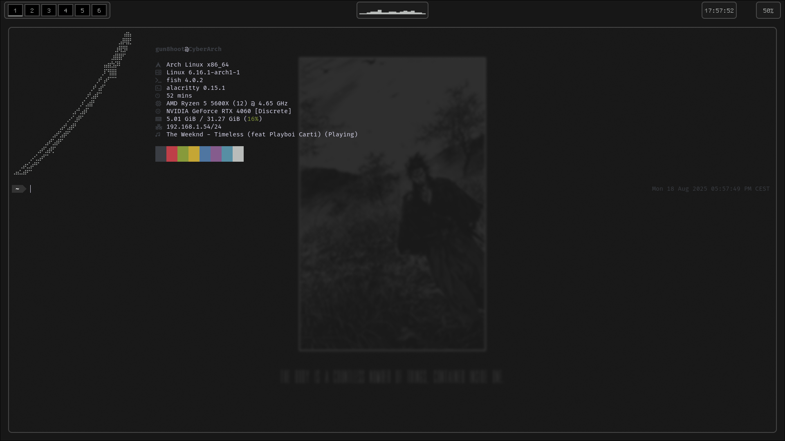

⚠️ ***THE THEME IS NOT FINISHED; SOME ELEMENTS CANNOT WORK OR CAN BE MISSING*** ⚠️

# 🗡️ • Vagabond
- To do this theme, i was took some inspiration to the Nothing ecosystem
- You can copy the .config from the theme directory to your home:
> ```sh
> cp -R ./.config ~/.config 
> ```

## 🖥️ • Overall
<a href="#"></a> 

<br>

---

### TODO : 
- [ ] - Rofi custom theme

<br>

## 📊 • Waybar
- In the futur i will do a custom script to get the current IP address. Currently i use the stock network module but the network stock module cannot switch to an interface to an another without editing the config file.

<br><br>

# 💡 • Sources
#### - [Wallpaper](https://wall.alphacoders.com/big.php?i=1323586)
#### - [Cava on the waybar](https://github.com/ray-pH/waybar-cava)
#### - [Font](https://www.programmingfonts.org/#gohufont-14)
#### - [Fastfetch Katana](https://emojicombos.com/katana-ascii-art)
#### - [Color Scheme](./color.scheme)